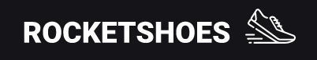

<h1 align="center">
  
</h1>

<h2 align="center" >Descrição do Projeto</h2>
<p align="center">
Aplicação desenvolvida no  desafio Ignite React da Rocketseat - Desafio 01 - Criando um hook de carrinho de compras.

</p>

<h1 align="center">
  
</h1>

## :rocket: Tecnologias

Esse projeto foi desenvolvido com as seguintes tecnologias:

✔️ React

✔️ Typescript

✔️ Styled-components

✔️ React-hooks

✔️ Sass

<h2>Pré-requisitos</h2>

Antes de começar, você vai precisar ter instalado em sua máquina as seguintes ferramentas:
[Git](https://git-scm.com) e [Node](https://nodejs.org/pt-br/).
Além disto é bom ter um editor para trabalhar com o código como [VSCode](https://code.visualstudio.com/).

# 👨‍💻 Rodando o Back End

```bash
# Clone este repositório
$ git clone https://github.com/gabriel-assana/RocketShoes
# Acesse a pasta do projeto no terminal/cmd
 cd RocketShoes
# Instale as dependências
$ yarn
# Execute a aplicação em modo de desenvolvimento
$ yarn server
# O servidor do back-end inciará na porta:3333 - acesse <http://localhost:3333>
```

# 👨‍💻 Rodando o Front End

```bash
# Acesse a pasta do projeto no terminal/cmd
$ cd RocketShoes
# Abra um novo terminal e execute a aplicação em modo de desenvolvimento
$ yarn dev
# O servidor do front-end inciará na porta:8080 - acesse <http://localhost:8080>
